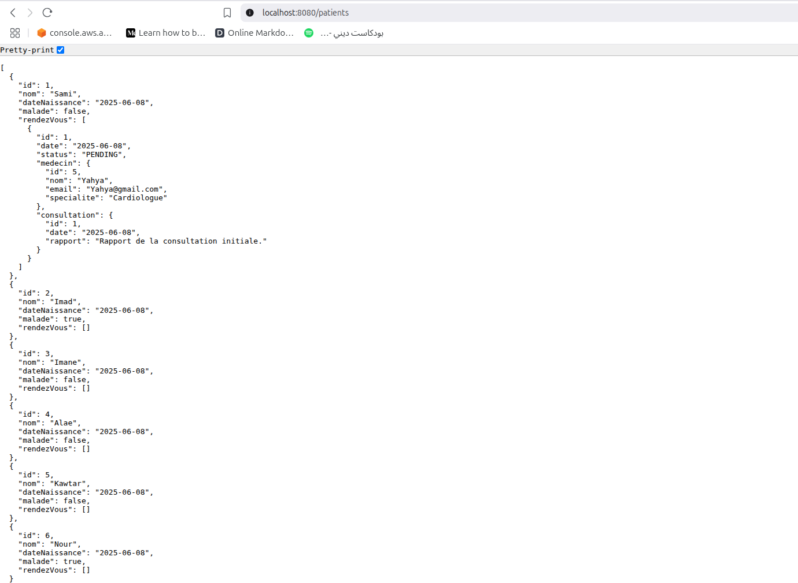
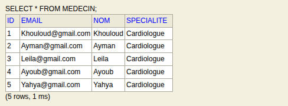
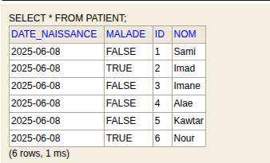
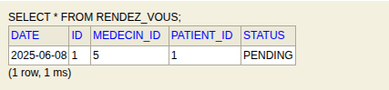
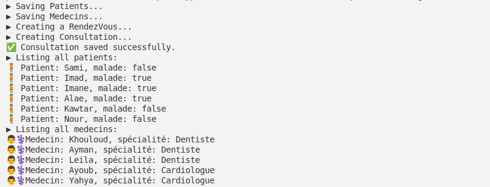

# Rapport TP - ORM JPA Hibernate Spring Data - Partie 3

## 📋 Description du Projet

Ce projet fait partie du TP3 sur **ORM JPA Hibernate** dans le cadre du cours JEE. Il s'agit d'une application Spring Boot qui simule un système de gestion hospitalière avec les entités principales : **Patient**, **Médecin**, **Rendez-vous** et **Consultation**.



## 🏗️ Architecture du Projet

```
hospital/
├── src/main/java/com/spring/hospital/
│   ├── HospitalApplication.java          # Classe principale Spring Boot
│   ├── entities/                         # Entités JPA
│   │   ├── Patient.java
│   │   ├── Medecin.java
│   │   ├── RendezVous.java
│   │   ├── Consultation.java
│   │   └── StatusRDV.java               # Énumération pour le statut RDV
│   ├── Repositories/                     # Couche d'accès aux données
│   │   ├── PatientRepository.java
│   │   ├── MedecineRepository.java
│   │   ├── RendezVousRepository.java
│   │   └── ConsultationRepository.java
│   ├── service/                          # Couche service
│   │   ├── IHospitalService.java
│   │   └── HospitalServiceImpl.java
│   └── web/                              # Couche contrôleur REST
│       └── PatientRestController.java
├── src/main/resources/
│   ├── application.properties            # Configuration Spring Boot
│   ├── static/                          # Ressources statiques
│   └── templates/                       # Templates (si nécessaire)
└── pom.xml                              # Configuration Maven
```

## 🛠️ Technologies Utilisées

- **Spring Boot 3.2.4** - Framework principal
- **Spring Data JPA** - Abstraction pour JPA
- **Hibernate 6.4.4** - Implémentation JPA/ORM
- **H2 Database** - Base de données en mémoire pour les tests
- **MySQL** - Base de données production (configurée)
- **Lombok** - Réduction du code boilerplate
- **Maven** - Gestionnaire de dépendances

## 📊 Modèle de Données et Relations

### Diagramme des Relations

```
Patient (1) ←---→ (N) RendezVous (N) ←---→ (1) Medecin
                        ↓ (1)
                        ↓
                   (1) Consultation
```

### Entités JPA

#### 1. **Patient** (`entities/Patient.java`)

```java
@Entity
@Data @NoArgsConstructor @AllArgsConstructor
public class Patient {
    @Id @GeneratedValue(strategy = GenerationType.IDENTITY)
    private Long id;
  
    private String nom;
    private Date dateNaissance;
    private boolean malade;
  
    @OneToMany(mappedBy = "patient", fetch = FetchType.LAZY)
    private List<RendezVous> rendezVous;
}
```

**Annotations utilisées :**

- `@Entity` : Marque la classe comme entité JPA
- `@Id` : Définit la clé primaire
- `@GeneratedValue(strategy = GenerationType.IDENTITY)` : Auto-incrémentation de l'ID
- `@OneToMany(mappedBy = "patient")` : Relation 1-N avec RendezVous
- `@Data`, `@NoArgsConstructor`, `@AllArgsConstructor` : Annotations Lombok

#### 2. **Medecin** (`entities/Medecin.java`)

```java
@Entity
@Data @NoArgsConstructor @AllArgsConstructor
public class Medecin {
    @Id @GeneratedValue(strategy = GenerationType.IDENTITY)
    private Long id;
  
    private String nom;
    private String email;
    private String specialite;
  
    @OneToMany(mappedBy = "medecin", fetch = FetchType.LAZY)
    private List<RendezVous> rendezVous;
}
```

#### 3. **RendezVous** (`entities/RendezVous.java`)

```java
@Entity
@Data @NoArgsConstructor @AllArgsConstructor
public class RendezVous {
    @Id @GeneratedValue(strategy = GenerationType.IDENTITY)
    private Long id;
  
    private Date date;
  
    @Enumerated(EnumType.STRING)
    private StatusRDV status;
  
    @ManyToOne
    @JoinColumn(name = "patient_id")
    private Patient patient;
  
    @ManyToOne
    @JoinColumn(name = "medecin_id")
    private Medecin medecin;
  
    @OneToOne(mappedBy = "rendezVous", cascade = CascadeType.ALL)
    private Consultation consultation;
}
```

**Annotations spécifiques :**

- `@ManyToOne` : Relation N-1 avec Patient et Medecin
- `@JoinColumn(name = "...")` : Spécifie le nom de la colonne de jointure
- `@OneToOne(mappedBy = "rendezVous")` : Relation 1-1 avec Consultation
- `@Enumerated(EnumType.STRING)` : Stockage de l'énumération comme STRING
- `cascade = CascadeType.ALL` : Propagation des opérations

#### 4. **Consultation** (`entities/Consultation.java`)

```java
@Entity
@Data @NoArgsConstructor @AllArgsConstructor
public class Consultation {
    @Id @GeneratedValue(strategy = GenerationType.IDENTITY)
    private Long id;
  
    private Date date;
    private String rapport;
  
    @OneToOne
    @JoinColumn(name = "rendez_vous_id")
    private RendezVous rendezVous;
}
```

#### 5. **StatusRDV** (`entities/StatusRDV.java`)

```java
public enum StatusRDV {
    PENDING, CONFIRMED, COMPLETED, CANCELLED
}
```

## 🗄️ Couche Repository (Spring Data JPA)

### Repositories avec Méthodes Personnalisées

#### PatientRepository

```java
@Repository
public interface PatientRepository extends JpaRepository<Patient, Long> {
    List<Patient> findByMaladeTrue();
    List<Patient> findByMaladeFalse();
    List<Patient> findByNomContaining(String nom);
    Patient findByNom(String nom);
}
```

#### MedecineRepository

```java
@Repository
public interface MedecineRepository extends JpaRepository<Medecin, Long> {
    List<Medecin> findBySpecialite(String specialite);
    Medecin findByNom(String nom);
    Medecin findByEmail(String email);
}
```

**Concepts Spring Data JPA utilisés :**

- `JpaRepository<Entity, ID>` : Interface de base avec CRUD
- **Query Methods** : Méthodes générées automatiquement à partir du nom
- **Derived Queries** : `findBy...`, `findBy...Containing`, etc.

## 🔧 Couche Service

### Interface IHospitalService

```java
public interface IHospitalService {
    Patient savePatient(Patient patient);
    Medecin saveMedecin(Medecin medecin);
    RendezVous saveRDV(RendezVous rendezVous);
    Consultation saveConsultation(Consultation consultation);
  
    Patient getPatientByNom(String nom);
    Medecin getMedecinByNom(String nom);
    List<Patient> getAllPatients();
    List<Medecin> getAllMedecins();
}
```

### Implémentation HospitalServiceImpl

```java
@Service
@Transactional
public class HospitalServiceImpl implements IHospitalService {
  
    @Autowired
    private PatientRepository patientRepository;
  
    @Autowired
    private MedecineRepository medecineRepository;
  
    // ... implémentations des méthodes
}
```

**Annotations utilisées :**

- `@Service` : Marque la classe comme service Spring
- `@Transactional` : Gestion automatique des transactions
- `@Autowired` : Injection de dépendance

## 🌐 Couche Web (REST Controller)

### PatientRestController

```java
@RestController
@RequestMapping("/patients")
public class PatientRestController {
  
    @Autowired
    private IHospitalService hospitalService;
  
    @GetMapping
    public List<Patient> getAllPatients() {
        return hospitalService.getAllPatients();
    }
  
    @PostMapping
    public Patient savePatient(@RequestBody Patient patient) {
        return hospitalService.savePatient(patient);
    }
}
```

**Annotations REST :**

- `@RestController` : Contrôleur REST (combine @Controller + @ResponseBody)
- `@RequestMapping` : Mapping de base pour l'URL
- `@GetMapping` : Endpoint GET
- `@PostMapping` : Endpoint POST
- `@RequestBody` : Désérialisation JSON → Objet Java

## ⚙️ Configuration

### application.properties

```properties
# Configuration H2 Database
spring.datasource.url=jdbc:h2:mem:hospital-db
spring.datasource.username=sa
spring.datasource.password=

# Configuration JPA/Hibernate
spring.jpa.hibernate.ddl-auto=update
spring.jpa.show-sql=true
spring.jpa.properties.hibernate.format_sql=true

# H2 Console
spring.h2.console.enabled=true
spring.h2.console.path=/h2-console

# Configuration serveur
server.port=8080
```

### Configuration Maven (pom.xml)

```xml
<dependencies>
    <dependency>
        <groupId>org.springframework.boot</groupId>
        <artifactId>spring-boot-starter-data-jpa</artifactId>
    </dependency>
    <dependency>
        <groupId>org.springframework.boot</groupId>
        <artifactId>spring-boot-starter-web</artifactId>
    </dependency>
    <dependency>
        <groupId>com.h2database</groupId>
        <artifactId>h2</artifactId>
        <scope>runtime</scope>
    </dependency>
    <dependency>
        <groupId>org.projectlombok</groupId>
        <artifactId>lombok</artifactId>
        <version>1.18.38</version>
        <scope>provided</scope>
    </dependency>
</dependencies>
```

## 🚀 Exécution et Initialisation des Données

### CommandLineRunner dans HospitalApplication

```java
@Bean
CommandLineRunner start(IHospitalService hospitalService) {
    return args -> {
        // Création de 6 patients
        Stream.of("Sami", "Imad", "Imane", "Alae", "Kawtar", "Nour")
            .forEach(name -> {
                Patient patient = new Patient();
                patient.setNom(name);
                patient.setMalade(Math.random() > 0.5);
                patient.setDateNaissance(new Date());
                hospitalService.savePatient(patient);
            });

        // Création de 5 médecins
        Stream.of("Khouloud", "Ayman", "Leila", "Ayoub", "Yahya")
            .forEach(name -> {
                Medecin medecin = new Medecin();
                medecin.setNom(name);
                medecin.setEmail(name + "@gmail.com");
                medecin.setSpecialite(Math.random() > 0.5 ? "Cardiologue" : "Dentiste");
                hospitalService.saveMedecin(medecin);
            });

        // Création d'un rendez-vous et consultation
        Patient patient = hospitalService.getPatientByNom("Sami");
        Medecin medecin = hospitalService.getMedecinByNom("Yahya");
    
        if (patient != null && medecin != null) {
            RendezVous rendezVous = new RendezVous();
            rendezVous.setDate(new Date());
            rendezVous.setMedecin(medecin);
            rendezVous.setPatient(patient);
            rendezVous.setStatus(StatusRDV.PENDING);
            RendezVous savedRDV = hospitalService.saveRDV(rendezVous);

            Consultation consultation = new Consultation();
            consultation.setDate(new Date());
            consultation.setRendezVous(savedRDV);
            consultation.setRapport("Rapport de la consultation initiale.");
            hospitalService.saveConsultation(consultation);
        }
    };
}
```

## Result

### 1. Console H2 Database


**URL d'accès :** http://localhost:8080/h2-console

- **JDBC URL :** `jdbc:h2:mem:hospital-db`
- **Username :** `sa`
- **Password :** (vide)


### 2. Données dans les Tables







## 🖥️ Sortie Console de l'Application

### Démarrage de l'Application

*[Espace réservé pour l'image de la sortie console au démarrage]*

```
2025-06-08T15:18:25.822+01:00  INFO 433951 --- [hospital] [           main] c.spring.hospital.HospitalApplication    : Started HospitalApplication in 5.795 seconds (process running for 6.53)
▶ Saving Patients...
▶ Saving Medecins...
▶ Creating a RendezVous...
▶ Creating Consultation...
✅ Consultation saved successfully.
▶ Listing all patients:
🧍 Patient: Sami, malade: false
🧍 Patient: Imad, malade: true
🧍 Patient: Imane, malade: false
🧍 Patient: Alae, malade: false
🧍 Patient: Kawtar, malade: false
🧍 Patient: Nour, malade: true
▶ Listing all medecins:
👨‍⚕️ Medecin: Khouloud, spécialité: Cardiologue
👨‍⚕️ Medecin: Ayman, spécialité: Cardiologue
👨‍⚕️ Medecin: Leila, spécialité: Cardiologue
👨‍⚕️ Medecin: Ayoub, spécialité: Cardiologue
👨‍⚕️ Medecin: Yahya, spécialité: Cardiologue
```




## 🔍 Concepts JPA/Hibernate Abordés

### 1. **Mapping Objet-Relationnel (ORM)**

- Transformation automatique entre objets Java et tables relationnelles
- Annotations de mapping (`@Entity`, `@Table`, `@Column`)

### 2. **Gestion des Relations**

- **@OneToMany** : Un patient peut avoir plusieurs rendez-vous
- **@ManyToOne** : Plusieurs rendez-vous pour un médecin
- **@OneToOne** : Un rendez-vous a une consultation unique
- **@JoinColumn** : Spécification des clés étrangères

### 3. **Stratégies de Génération d'ID**

- `@GeneratedValue(strategy = GenerationType.IDENTITY)` : Auto-incrémentation

### 4. **Types de Fetch**

- `FetchType.LAZY` : Chargement à la demande
- `FetchType.EAGER` : Chargement immédiat

### 5. **Cascade Operations**

- `CascadeType.ALL` : Propagation de toutes les opérations
- `CascadeType.PERSIST`, `CascadeType.REMOVE`, etc.

### 6. **Énumérations JPA**

- `@Enumerated(EnumType.STRING)` : Stockage des énums comme chaînes

### 7. **Repository Pattern avec Spring Data JPA**

- `JpaRepository<Entity, ID>` : CRUD automatique
- **Derived Queries** : Génération automatique de requêtes
- **Custom Queries** : Requêtes personnalisées

## 🌐 API REST Endpoints

| Method | URL                | Description                   |
| ------ | ------------------ | ----------------------------- |
| GET    | `/patients`      | Récupérer tous les patients |
| POST   | `/patients`      | Créer un nouveau patient     |
| GET    | `/patients/{id}` | Récupérer un patient par ID |
| PUT    | `/patients/{id}` | Modifier un patient           |
| DELETE | `/patients/{id}` | Supprimer un patient          |

## 🔧 Comment Exécuter le Projet

### 1. Prérequis

- Java 17 ou supérieur
- Maven 3.6+

### 2. Compilation et Exécution

```bash
# Compilation
./mvnw clean compile

# Exécution avec Maven
./mvnw spring-boot:run

# Ou exécution du JAR
./mvnw package
java -jar target/patient-0.0.1-SNAPSHOT.jar
```

### 3. Accès aux Interfaces

- **Application :** http://localhost:8080
- **H2 Console :** http://localhost:8080/h2-console
- **API REST :** http://localhost:8080/patients

## 📚 Concepts Avancés Utilisés

### 1. **Injection de Dépendance**

- `@Autowired` pour l'injection automatique
- Inversion de contrôle (IoC)

### 2. **Annotations Lombok**

- `@Data` : Génère getters, setters, toString, equals, hashCode
- `@NoArgsConstructor` : Constructeur sans arguments
- `@AllArgsConstructor` : Constructeur avec tous les arguments

### 3. **Gestion des Transactions**

- `@Transactional` au niveau service
- Rollback automatique en cas d'exception

### 4. **Configuration Automatique Spring Boot**

- Auto-configuration des beans
- Propriétés externalisées
- Embedded server (Tomcat)
